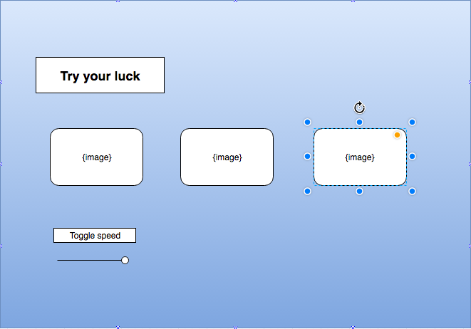

# casinoGame
This is a repo for the first project.

User Stories

Start Game

When the game starts a series of images will cycle through three squares.

When the user clicks on one of the squares the images will no longer cycle. Rather it will freeze on the image the user has clicked

When all three squares are clicked on the game is over.  If all three squares are the same the user has won. If all three are not the same the user has lost.

The user will be prompted if they have won or lost.

There will be two settings the user can toggle to effect the speed of the cycles

